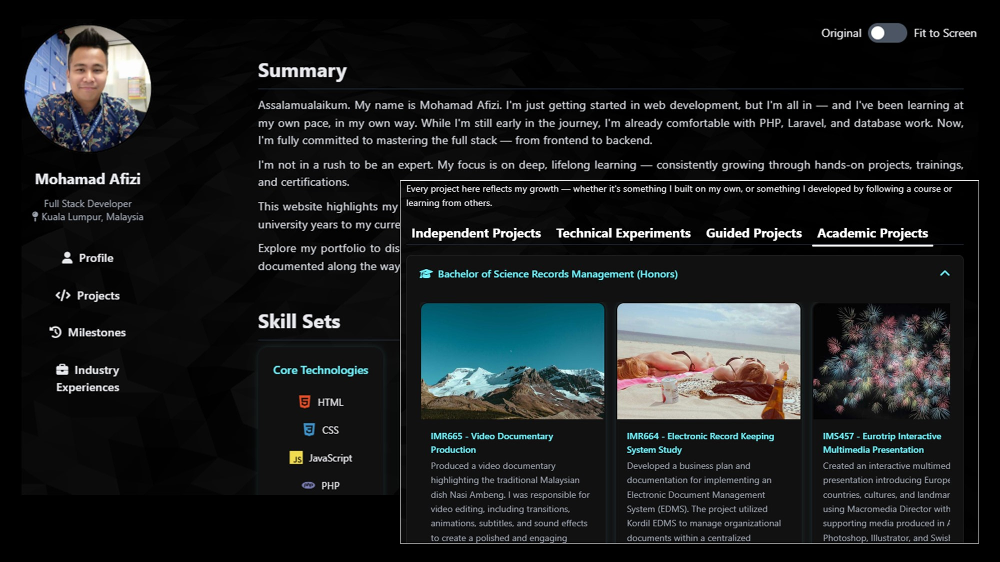

<div align="center">

# 💼 Personal Portfolio — Version 2

**A self-hosted, modular portfolio documenting the systems I have built, the experience behind them, and my continued development as an application developer and systems analyst.**


[**View Live Portfolio**](https://www.fizzyjamal.site)

*The second iteration of my portfolio—rebuilt to reflect the transition from learning front-end fundamentals to building and operating real systems.*

</div>

---

## 📖 About This Project

This repository contains the second version of my personal portfolio website. It brings together independent projects, deliberate technical experiments, academic work, professional milestones, and production experience in one structured interface.

Unlike the static first version, Portfolio v2 uses PHP includes to separate shared layout and content sections. It also introduces nested tabs, accordions, modal content, animated project images, an interactive background, and a layout-width toggle. The site is developed in a containerized PHP and Apache environment and deployed through my own self-hosted infrastructure.

The portfolio is designed around evidence rather than a conventional resume summary: each section records a system built, a problem addressed, or a skill deliberately developed.

## 🖥️ Website Preview



## 🧭 Explore the Portfolio

| Section | What it contains |
| --- | --- |
| 👤 **Profile** | Professional summary and grouped technical skills across development, databases, tools, and infrastructure |
| 🛠️ **Projects** | Independent systems, learning experiments, data projects, and academic work |
| 🎯 **Milestones** | Learning paths, skills-validated certifications, and completed professional courses |
| 💼 **Industry Experiences** | Production systems and enhancements delivered against real business requirements and constraints |

Projects and milestones use secondary tabs to keep a large body of work organised without navigating away from the page. Academic work, course categories, and professional experience use expandable accordions for the same reason.

## ✨ Interface and Interaction

The site retains the dark, content-focused direction of the first portfolio while introducing a more dynamic visual identity and a denser information structure.

- **Persistent sidebar navigation** — keeps the profile and primary sections accessible throughout the experience
- **Tabbed content** — switches between major sections and nested project or milestone categories without a page reload
- **Expandable accordions** — groups academic projects, courses, and industry work into manageable sections
- **Detail modals** — supports additional project information loaded from HTML or JSON content
- **Animated project cards** — cycles through multiple screenshots where a project has more than one image
- **Adjustable content width** — switches between a centred reading width and a fit-to-screen layout
- **Sequential skill animation** — introduces skill badges progressively when the profile loads
- **Interactive background** — uses Vanta.js and Three.js to render responsive wave animation

The main sections are assembled in PHP rather than maintained as one large page:

```php
<?php include 'sections/profile.php'; ?>
<?php include 'sections/projects.php'; ?>
<?php include 'sections/milestones.php'; ?>
<?php include 'sections/industry_experiences.php'; ?>
```

## 🔄 What Changed from Version 1

| Version 1 | Version 2 |
| --- | --- |
| Single HTML document | Modular PHP includes and section files |
| Static anchor navigation | JavaScript-driven primary and nested tabs |
| Simple show/hide interaction | Tabs, accordions, modals, image transitions, and layout controls |
| GitHub Pages hosting | Self-hosted Apache environment |
| Front-end learning snapshot | Evidence of independent, academic, infrastructure, and production work |
| Lightweight static workflow | Docker Compose environment for local development |

Version 1 remains part of the portfolio as a record of where the journey began. Version 2 is both a broader professional record and a practical environment for learning deployment, server administration, interface design, and maintainable content organisation.

## 🛠️ Built With

| Technology / Tool | Role in the project |
| --- | --- |
| **PHP 8.4** | Server-side assembly of shared includes, sections, and tab content |
| **HTML5** | Structure, cards, navigation, modals, and content presentation |
| **Tailwind CSS** | Utility-based layout, spacing, typography, colour, and responsive styling |
| **Custom CSS** | Portfolio-specific cards, animations, accordions, modal styling, and responsive behaviour |
| **JavaScript** | Tab switching, accordions, modals, image fades, skill animation, and layout controls |
| **Three.js and Vanta.js** | Interactive animated background |
| **Font Awesome and Devicon** | Navigation, interface, and technology icons |
| **Docker Compose** | Reproducible local PHP and Apache development environment |
| **Apache HTTP Server** | Web server used locally and in the self-hosted deployment workflow |

## 📁 Project Structure

```text
portfoliov2/
├── compose.yaml                 # Local PHP and Apache service
├── README.md                    # Repository documentation
└── src/
    ├── index.php                # Main page composition
    ├── includes/                # Shared header and footer
    ├── sections/
    │   ├── profile.php
    │   ├── projects.php
    │   ├── milestones.php
    │   ├── industry_experiences.php
    │   └── tabs/                # Project, milestone, and experience content
    ├── assets/
    │   ├── css/style.css        # Custom presentation and responsive rules
    │   ├── js/app.js            # Client-side interaction
    │   ├── images/              # Project and portfolio screenshots
    │   └── documents/           # Downloadable project files
    └── json/                     # Structured content prepared for modal loading
```

The content remains file-based, with no application database, package manager, or asset build step required.

## 💻 Local Development

The included Compose configuration mounts the `src` directory into an Apache container running PHP 8.4:

```bash
docker compose up -d
```

The portfolio is then available at `http://localhost:8080`.

Changes inside `src` are reflected through the mounted volume, so the container does not need to be rebuilt for ordinary content, PHP, CSS, or JavaScript updates.

To stop the local environment:

```bash
docker compose down
```

## 🚀 Development and Deployment Workflow

```text
Develop and review locally
        ↓
Run through Docker Compose
        ↓
Commit and push with Git
        ↓
Deploy to the self-hosted Apache server
```

External libraries are currently delivered through content delivery networks, so an internet connection is required for Tailwind CSS, Three.js, Vanta.js, Font Awesome, and Devicon to load fully.

---

<div align="center">

### 🌐 Built as both a professional record and a live exercise in owning the full stack

**Self-made. Self-hosted. Continuously improved.**

</div>
